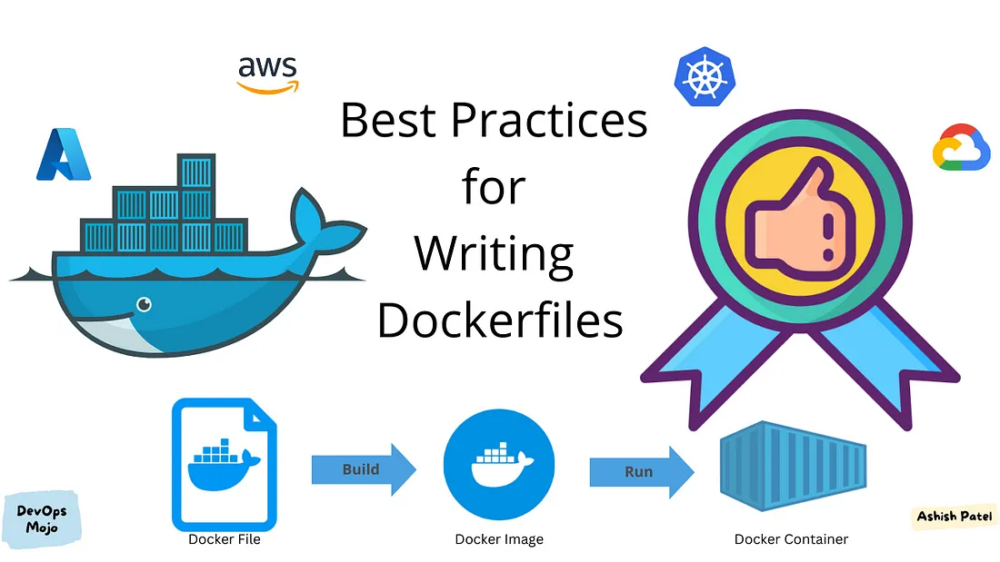

# 🐳 Dockerfiles for Beginners
<div align="center">
    
</div>

This folder contains **basic Dockerfiles** for beginners to get started with **containerizing applications**.

---

## 📌 How to Use?
To build and run a container using a Dockerfile:
```bash
# Build the Docker image
docker build -t <name:tag> .

# Run the container
docker run -d -p <host_port:container_port> <name:tag>